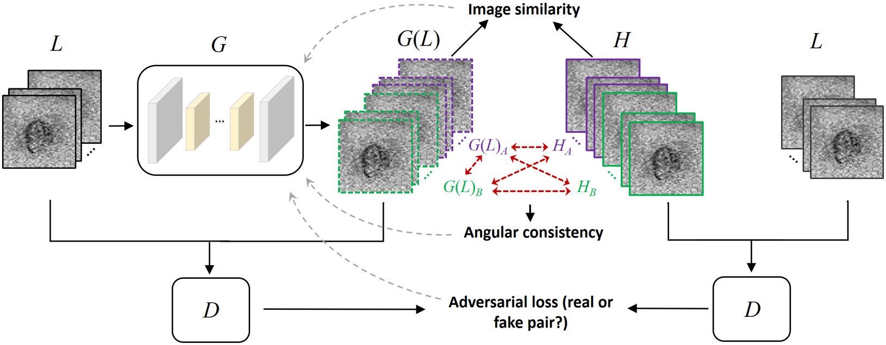

# dMRI signal-loss compensation in PyTorch

This code is developed to compensate for signal loss caused by motion in in vivo diffusion tensor imaging (DTI) of the human heart. The main idea is to improve the angular resolution of the acquired diffusion weighted images, where the angular resolution here is defined by the number of used diffusion gradient directions during DTI. 

The method is built on a generative inverse network (GAN) to learn the mapping from the lower angular-resolution DW images to the higher angular-resolution DW images, for example:



**Note**: The current software works well with PyTorch 1.4. If necessary, please refer to one of an earlier [network's environment](https://github.com/junyanz/pytorch-CycleGAN-and-pix2pix/tree/pytorch0.3.1) that supports PyTorch 0.1-0.3.

## Prerequisites
- Linux or macOS
- Python 3
- CPU or NVIDIA GPU + CUDA CuDNN

## Getting Started
### Installation
Install [PyTorch](http://pytorch.org) and 0.4+ and other dependencies (e.g., torchvision, [visdom](https://github.com/facebookresearch/visdom) and [dominate](https://github.com/Knio/dominate)).
  - For pip users, please type the command `pip install -r requirements.txt`.
  - For Conda users, you can create a new Conda environment using `conda env create -f environment.yml`.
  - For Docker users, we provide the pre-built Docker image and Dockerfile. Please refer to our [Docker](docs/docker.md) page.

### Training and testing the network:
- Convert image data to the network's input format before training. For example, each training sample with a dimension of 128x128x36 could be saved as "realAB_1_s1" (see an example in "\datasets\infant_Bru_192P2_14_23\") indicating the 1st training sample for the 1st slice of the human heart that contains 12 original DW images and its 24 higher angular-resolution groud-truth DW images.

- All the parameters for training and testing could be changed using the three files "\options\base_options", "\options\train_options", and "\options\test_options". The optimal setting may vary depending on different tasks. 

- The network's layers and training constraints could be changed using the file "\models\networks" or "\models\networks_v2".

- Train a model:
```
Using the .pbs files in "experiments_part1" or "experiments_part2" to set the training parameters and to run the code "train.py".
The intermediate trained network models will be saved in "./checkpoints/".
```

- Test the model:
```
Using the .pbs files in "experiments_part1" or "experiments_part2" to set the testing parameters and to run the code "test.py".
The tested results will be saved in "./results".
```

## Citation
The present work is an extension of several proevious studies:

He Y, Wang L, Yang F, Xia Y, Clarysse P, Zhu Y, Systematic study of joint influence of angular resolution and noise in cardiac diffusion tensor imaging. 11th International Conference on Functional Imaging and Modeling of the Heart, FIMH 2021, Stanford, CA, USA, June 21-25, LNCS, vol. 12738, pp. 200–210, 2021.

He Y, Wang L, Yang F, Clarysse P, Zhu Y. Study of motion compensation for in vivo DTI of the human heart. 2nd Sino-French Workshop on “Medical Image Analysis and AI”, Virtual, France, October 25-26, 2021.

He Y, Wang L, Yang F, Clarysse, P, Zhu Y, Deep group-wise angular translation of cardiac diffusion MRI in q-space via manifold regularized GAN. 15th IEEE International Conference on Signal Processing, ICSP 2020, Beijing, China, December 6-9, vol. 1, pp. 511–515, 2020.

If you use this code for your research, please cite at least the paper:
```
@inproceedings{he2020deep,
  title={Deep Group-Wise Angular Translation of Cardiac Diffusion MRI in q-space via Manifold Regularized GAN},
  author={He, Yunlong and Wang, Lihui and Yang, Feng and Clarysse, Patrick and Zhu, Yuemin},
  booktitle={2020 15th IEEE International Conference on Signal Processing (ICSP)},
  volume={1},
  pages={511--515},
  year={2020},
  organization={IEEE}
}
```

## Acknowledgments
Our code and network is inspired by [pytorch-DCGAN](https://github.com/pytorch/examples/tree/master/dcgan) and [pix2pix-GAN](https://github.com/junyanz/CatPapers). See bellow links the original networks if your are also interested in nature image translation:

Image-to-Image Translation with Conditional Adversarial Networks.<br>
[Phillip Isola](https://people.eecs.berkeley.edu/~isola), [Jun-Yan Zhu](https://www.cs.cmu.edu/~junyanz/), [Tinghui Zhou](https://people.eecs.berkeley.edu/~tinghuiz), [Alexei A. Efros](https://people.eecs.berkeley.edu/~efros). In CVPR 2017. [[Bibtex]](https://www.cs.cmu.edu/~junyanz/projects/pix2pix/pix2pix.bib).

## Update
Last modification by Yunlong HE on Apr. 2023. Yunlong.He@insa-lyon.fr
